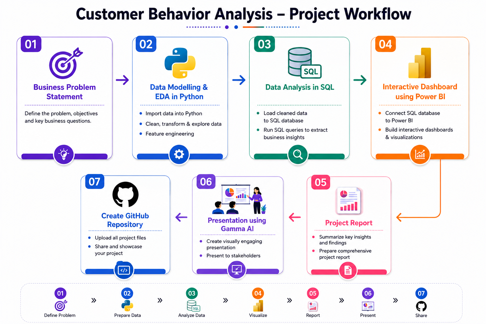
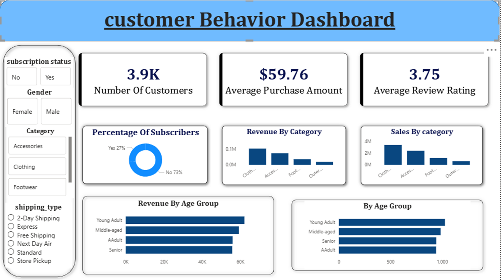
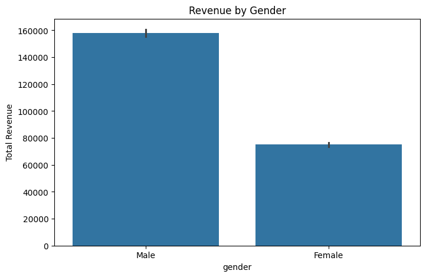
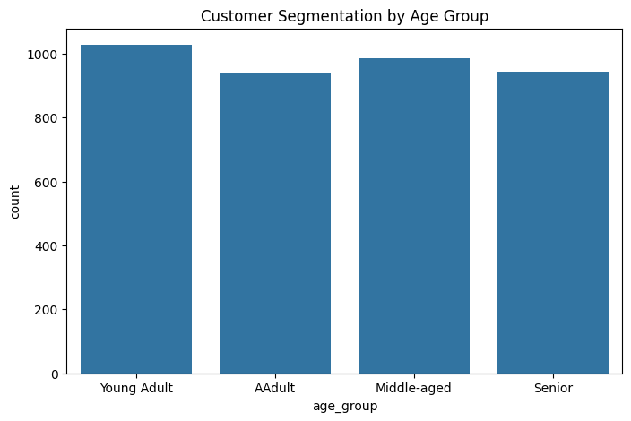
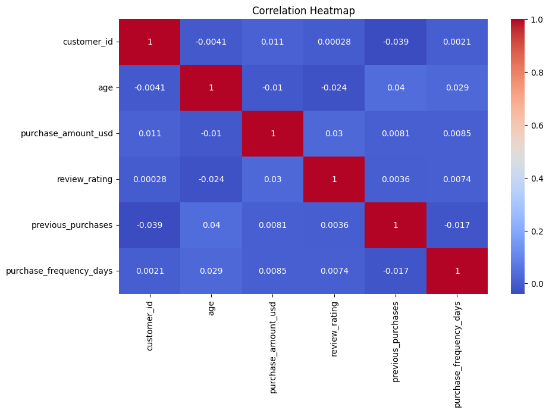
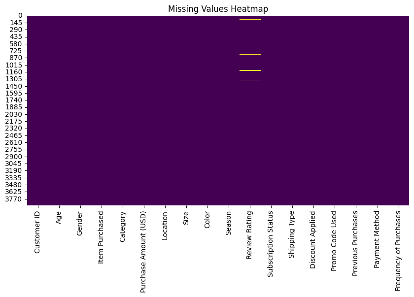
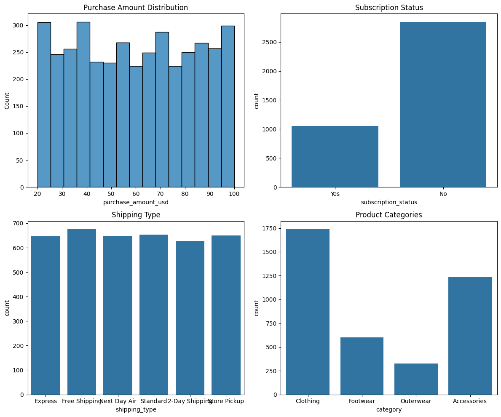

# Customer Shopping Behavior Analysis


A complete end-to-end data analytics portfolio project focused on analyzing customer shopping behavior using Python, SQL, MySQL, and Power BI.

The project transforms raw retail transaction data into actionable business insights through data cleaning, exploratory data analysis, SQL-based business analysis, and interactive dashboard visualization.

---

# Table of Contents

- Overview
- Features
- Business Problem Statement
- Business Question
- Project Workflow
- Dataset Summary
- Tools & Technologies
- Data Cleaning & Feature Engineering
- SQL Business Analysis
- Key Insights
- Power BI Dashboard
- Project Screenshots
- Business Recommendations
- Repository Structure
- Project Outcome
- Author

---

# Overview

This project analyzes customer shopping behavior to understand:
- purchasing patterns
- customer demographics
- subscription behavior
- discount usage
- product performance
- shipping preferences

The analysis helps businesses make data-driven decisions to improve customer engagement, increase revenue, and optimize marketing strategies.

---

# Features

✅ Data Cleaning & Preprocessing  
✅ Exploratory Data Analysis (EDA)  
✅ SQL Business Analysis  
✅ Customer Segmentation  
✅ Revenue Trend Analysis  
✅ Power BI Dashboard  
✅ Business Recommendations  
✅ End-to-End Analytics Workflow  

---

# Business Problem Statement

A leading retail company wants to better understand customer shopping behavior to improve sales, customer satisfaction, and long-term loyalty.

The company is interested in identifying how factors such as:
- discounts
- subscriptions
- shipping preferences
- customer demographics
- product categories

influence purchasing decisions and repeat purchases.

---

# Business Question

"How can the company leverage consumer shopping data to identify trends, improve customer engagement, and optimize marketing and product strategies?"

---

# Project Workflow



## Workflow Steps

1. Business Problem Understanding  
2. Data Collection  
3. Data Cleaning & Preprocessing  
4. Exploratory Data Analysis (EDA)  
5. SQL-Based Business Analysis  
6. Dashboard Development in Power BI  
7. Business Insights & Recommendations  
8. Portfolio Documentation  

---

# Dataset Summary

| Attribute | Value |
|---|---|
| Total Rows | 3900 |
| Total Columns | 18 |
| Dataset Type | Retail Transaction Data |
| File Format | CSV |

## Features Include

- Customer demographics
- Purchase details
- Subscription status
- Shipping information
- Product categories
- Review ratings
- Discount usage

---

# Tools & Technologies

## Programming & Analysis
- Python
- Pandas
- NumPy

## Data Visualization
- Matplotlib
- Seaborn

## Database & Querying
- SQL
- MySQL

## Dashboarding
- Power BI

## Development Environment
- Jupyter Notebook
- VS Code

---

# Data Cleaning & Feature Engineering

The dataset underwent multiple preprocessing and cleaning steps before analysis.

## Cleaning Steps Performed

- Checked missing/null values
- Removed duplicate records
- Standardized column names
- Verified data consistency
- Converted categorical columns
- Handled inconsistent data types
- Created age-group segmentation
- Performed purchase frequency transformation
- Removed redundant/unnecessary columns
- Validated dataset structure
- Performed feature engineering
- Checked data distributions and outliers

---

# SQL Business Analysis

## Business Questions Solved

- Which gender generated the highest revenue?
- Which age group contributes most to sales?
- Do subscribed customers spend more?
- Which product categories perform best?
- Which shipping method is preferred most?
- Does discount usage affect purchase behavior?
- Which customers are repeat buyers?
- Which products receive the highest ratings?

---

# Key Insights

- Male customers generated slightly higher total revenue compared to female customers.
- Young adults were identified as the most active customer segment.
- Loyal customers contributed significantly to repeat purchases.
- Subscription-based customers showed better purchase consistency.
- Express shipping users demonstrated higher average purchase values.
- Discounts strongly influenced purchasing behavior for selected product categories.
- Clothing and electronics categories contributed significantly to total sales.
- Review ratings positively impacted repeat customer purchases.

---

# Power BI Dashboard

## Dashboard Features

- KPI Cards
- Revenue Analysis
- Customer Segmentation
- Product Performance Analysis
- Subscription Insights
- Age Group Revenue Distribution
- Shipping Method Analysis
- Interactive Filters & Slicers

---

# Dashboard Preview



---

# Project Screenshots

## Revenue Analysis


## Customer Segmentation


## Correlation Heatmap


## Null Value Handling


## EDA Graphs


---

# Business Recommendations

- Improve customer loyalty programs
- Promote subscription benefits
- Optimize discount strategies
- Focus on high-performing products
- Use targeted marketing campaigns
- Improve personalized marketing using customer segmentation

---

# Repository Structure

```text
customer-shopping-behavior-analysis/
│
├── data/
│   └── customer_shopping_behavior.csv
│
├── notebooks/
│   └── customer_behavior_analysis.ipynb
│
├── sql/
│   └── MYSQL.sql
│
├── dashboard/
│   └── Customer_Behavior_Dashboard.pbix
│
├── report/
│   └── Customer_Shopping_Behavior_Report.pdf
│
├── presentation/
│   └── Customer_Behavior_Presentation.pptx
│
├── images/
│   ├── workflow.png
│   ├── dashboard_preview.png
│   ├── null_values.png
│   ├── correlation_heatmap.png
│   ├── revenue_analysis.png
│   ├── customer_segmentation.png
│   └── eda_graphs.png
│
└── README.md
```

---

# Project Outcome

This project successfully transformed raw retail transaction data into meaningful business insights using data analytics, SQL querying, visualization techniques, and dashboard development.

The analysis demonstrates how businesses can leverage customer shopping data to improve strategic decision-making and customer engagement.

---

# Author

## Madhura Barve

Full Stack & AI/ML Developer passionate about building impactful data-driven applications.

### Connect With Me

[LinkedIn](https://www.linkedin.com/in/madhura-barve-216629308/) •
[GitHub](https://github.com/MADHURA1907) •
[Email](mailto:barvemadhura19@gmail.com)